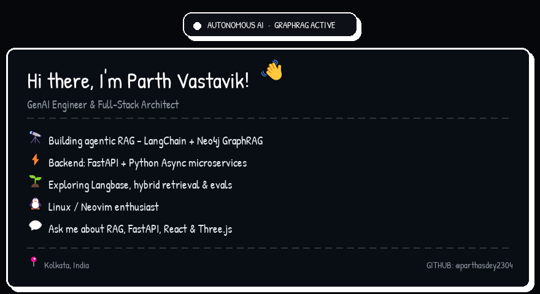

  

  <em>GitHub strips <code>&lt;script&gt;</code>/<code>&lt;canvas&gt;</code> from READMEs, so the interactive warp is pre-rendered above as a looping GIF — open <code>preview.html</code> for the live mouse-tracking demo.</em> 
  <a href="./preview.html">preview.html source</a> • <a href="https://linkedin.com/in/sarathiparth">Connect on LinkedIn</a>

  
  
  
  

  
  
  
  
  
  

  

  

  
  

  

  

  

  

