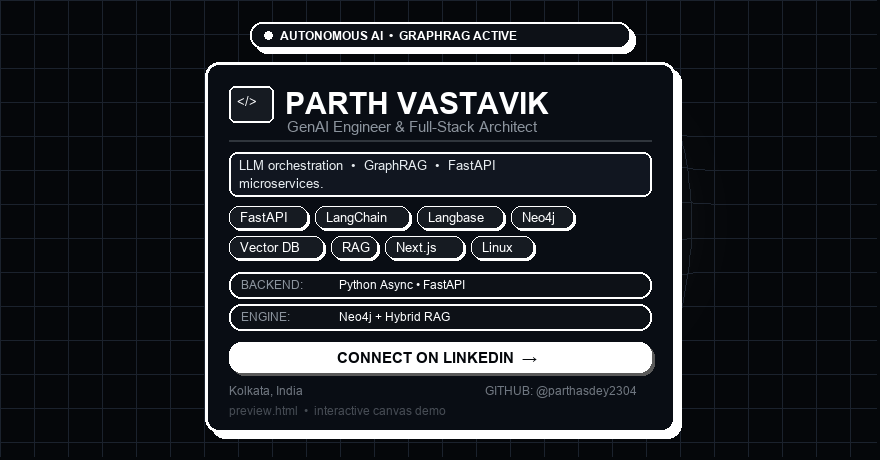

  

  <em>Interactive 3D grid warp + Excalidraw card — GitHub strips &lt;script&gt;/&lt;canvas&gt;, so the live demo (<code>preview.html</code>) is pre-rendered above as a looping GIF.</em> 
  <a href="./preview.html">Live interactive demo</a> • <a href="https://linkedin.com/in/sarathiparth">Connect on LinkedIn</a>

<h1 align="center">Hi there, I'm Parth Vastavik! 👋 </h1>

<strong>GenAI Engineer & Full-Stack Architect</strong> — architecting low-latency LLM orchestration, GraphRAG reasoning, and high-throughput microservices. 📍 Kolkata, India

- 🔭 Currently building **Agentic RAG systems (LangChain + Neo4j GraphRAG + Vector DBs)**
- ⚡ Core backend: **FastAPI + Python Async** microservices
- 🌱 Currently exploring **Langbase pipes, hybrid retrieval, eval harnesses**
- 🔥 **Linux / Neovim** enthusiast
- 💬 Ask me about **RAG pipelines, GraphRAG, FastAPI, React/Next.js, Three.js**
- 📫 Reach me: <a href="https://linkedin.com/in/sarathiparth">LinkedIn</a>

# Stay Connected

  
  
  
  

# Tech Stack

### 🤖 Autonomous AI & RAG

### ⚡ High-Performance APIs

### 🎨 Modern UI & 3D

### 🗄️ Databases & Infrastructure

### 🧰 Languages & Tooling

# Open Source

](https://holopin.io/@parthasdey2304)

